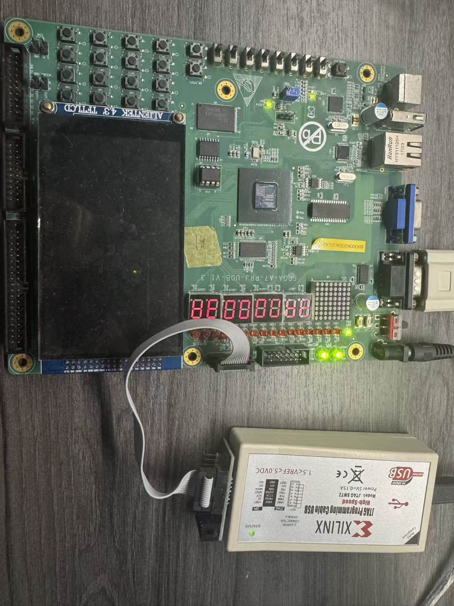

# FPGA Board Test Evidence

This directory records the physical FPGA-board verification of the **LoongArch32 Out-of-Order CPU on FPGA** project.

## Functional test: 3A

The board-level functional test photo shows the FPGA board connected through the Xilinx JTAG programmer, with the seven-segment display reporting the expected `3A 00 00 3A` result.

## Performance test: 20 items

The performance-test photos are stored as twenty numbered pairs:

- `N-red.jpg`: the board state marking the progress at performance item N.
- `N.jpg`: the corresponding score/result displayed by the board.

| Item | Test-progress photo | Score/result photo |
|---:|---|---|
| 1 | [1-red.jpg](performance/1-red.jpg) | [1.jpg](performance/1.jpg) |
| 2 | [2-red.jpg](performance/2-red.jpg) | [2.jpg](performance/2.jpg) |
| 3 | [3-red.jpg](performance/3-red.jpg) | [3.jpg](performance/3.jpg) |
| 4 | [4-red.jpg](performance/4-red.jpg) | [4.jpg](performance/4.jpg) |
| 5 | [5-red.jpg](performance/5-red.jpg) | [5.jpg](performance/5.jpg) |
| 6 | [6-red.jpg](performance/6-red.jpg) | [6.jpg](performance/6.jpg) |
| 7 | [7-red.jpg](performance/7-red.jpg) | [7.jpg](performance/7.jpg) |
| 8 | [8-red.jpg](performance/8-red.jpg) | [8.jpg](performance/8.jpg) |
| 9 | [9-red.jpg](performance/9-red.jpg) | [9.jpg](performance/9.jpg) |
| 10 | [10-red.jpg](performance/10-red.jpg) | [10.jpg](performance/10.jpg) |
| 11 | [11-red.jpg](performance/11-red.jpg) | [11.jpg](performance/11.jpg) |
| 12 | [12-red.jpg](performance/12-red.jpg) | [12.jpg](performance/12.jpg) |
| 13 | [13-red.jpg](performance/13-red.jpg) | [13.jpg](performance/13.jpg) |
| 14 | [14-red.jpg](performance/14-red.jpg) | [14.jpg](performance/14.jpg) |
| 15 | [15-red.jpg](performance/15-red.jpg) | [15.jpg](performance/15.jpg) |
| 16 | [16-red.jpg](performance/16-red.jpg) | [16.jpg](performance/16.jpg) |
| 17 | [17-red.jpg](performance/17-red.jpg) | [17.jpg](performance/17.jpg) |
| 18 | [18-red.jpg](performance/18-red.jpg) | [18.jpg](performance/18.jpg) |
| 19 | [19-red.jpg](performance/19-red.jpg) | [19.jpg](performance/19.jpg) |
| 20 | [20-red.jpg](performance/20-red.jpg) | [20.jpg](performance/20.jpg) |

These photos are supplementary physical-board evidence. The machine-readable test output remains available in [`reports/final/perf_vio.csv`](../source/reports/final/perf_vio.csv).
