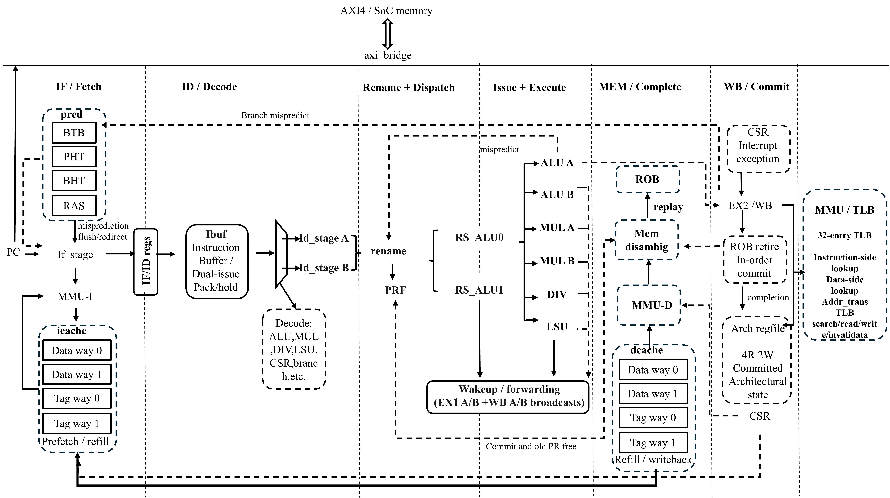

# LoongArch32 Out-of-Order CPU on FPGA

## FPGA board test evidence

The CPU has been programmed onto the FPGA board through the Xilinx JTAG interface. The functional board test reaches the expected `3A 00 00 3A` display result:

The complete set of twenty performance-test pairs is documented in [`evidence/README.md`](../evidence/README.md). Files ending in `-red` record the progress marker for a test item; the matching numbered file records the score shown on the board.

本目录基于 ChipLab 项目实践基线提交 `a0205122a7186144dcfd73a836ff9b436638b1da`，目标环境为 Windows、Vivado 2023.2、`xc7a200tfbg676-2`。

- 完整构建、仿真、烧板和结果说明：[`README_SUBMISSION.md`](README_SUBMISSION.md)
- 项目开发环境说明：[`nscscc_readme.md`](nscscc_readme.md)
- CPU RTL：[`IP/myCPU`](IP/myCPU)
- 最终 bit/ltx：[`fpga/nscscc-team/run_vivado/bitstreams`](fpga/nscscc-team/run_vivado/bitstreams)
- 最终报告和板测记录：[`reports/final`](reports/final)
- 板级实测照片与测试说明：[`evidence/README.md`](evidence/README.md)

当前默认 `soc_config.vh` 为性能测试模式；所有构建脚本都会按 `func`/`perf` 自动切换，不需要手工改宏。
